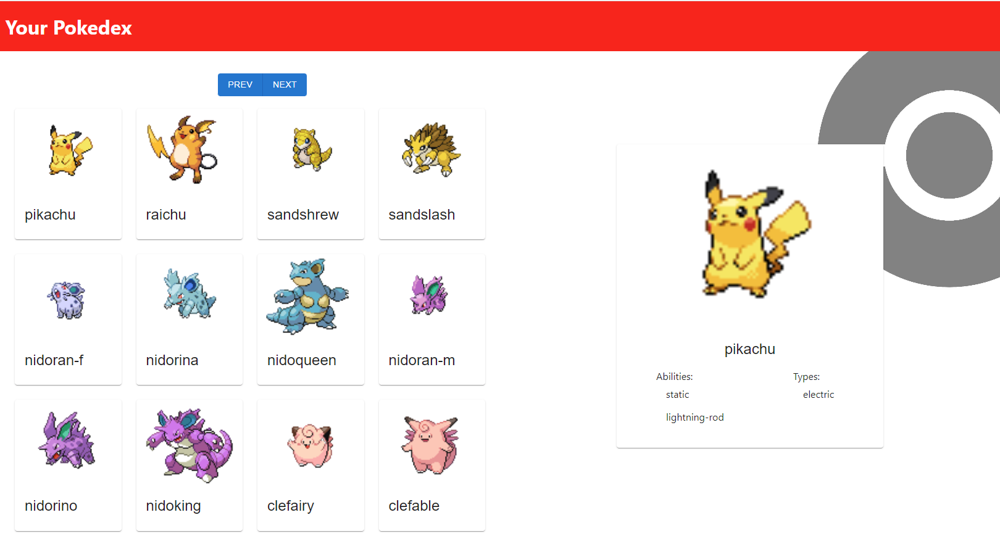

=======
# TypescriptDex

A weekend Typescript challenge, this one was challenging but I'm happy with the result. 
A Pokedex React Typescript CRUD Application that consumes Web API with Hooks and Axios from [PokéAPI](https://pokeapi.co/) and displays the data with Router & Bootstrap.

## Available Scripts

In the project directory, you can run:

### `install npm`
Installs npm and prerequisites

### `npm start`

Runs the app in the development mode.\
Open [http://localhost:3000](http://localhost:3000) to view it in the browser.

The page will reload if you make edits.\
You will also see any lint errors in the console.

### `npm test`

Launches the test runner in the interactive watch mode

### `npm run build`

Builds the app for production to the `build` folder.\
It correctly bundles React in production mode and optimizes the build for the best performance.

The build is minified and the filenames include the hashes.\
Your app is ready to be deployed!

To learn React, check out the [React documentation](https://reactjs.org/).
=======

>>>>>>> e6187e8a3de1b9b01dc0e0983f3500c7ceb619e5
